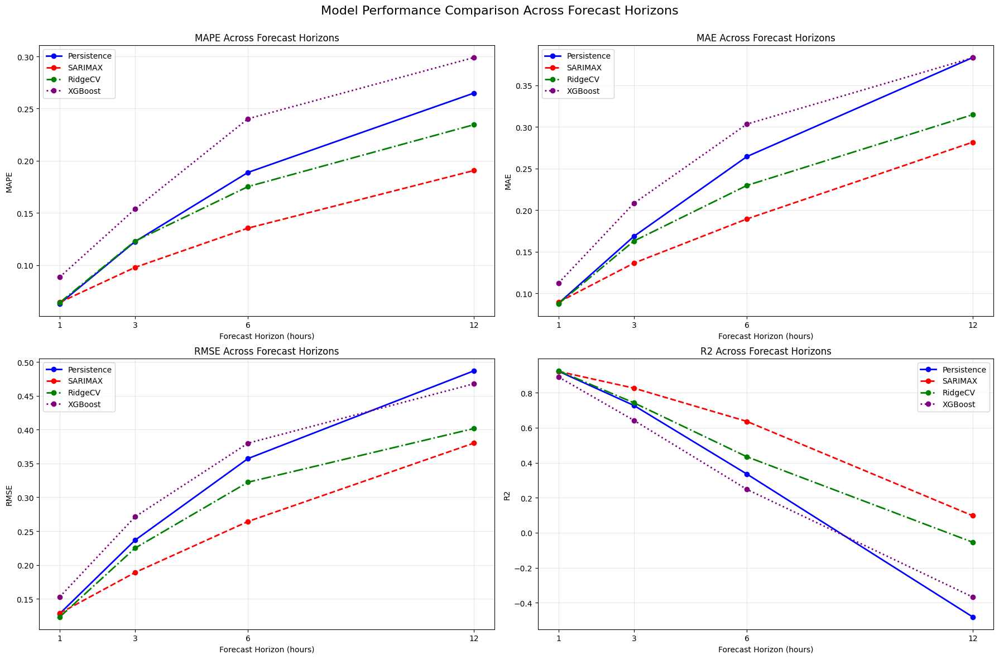

# NOAA Dataset Project

[](https://numpy.org/doc/stable//release/2.3.0-notes.html)
[](https://scikit-learn.org/stable/whats_new/v1.7.html)
[](https://www.statsmodels.org/v0.14.4/index.html)
[](https://xgboost.readthedocs.io/en/stable/)
[](https://opensource.org/licenses/MIT)

This project develops and evaluates predictive models to forecast significant wave height using time-series data from three NOAA oceanic buoys (46041, 46050, 46243). The core challenge of this dataset is a fundamental conflict between two competing predictive signals: a strong **autoregressive signal** and a weaker **meteorological signal**.

The analysis compares a naive persistence baseline against a statistical model (SARIMAX), and machine learning models (RidgeCV, XGBoost) across four forecast horizons (1, 3, 6, and 12 hours).

The main conclusion is that for this dataset, the SARIMAX model provides the best results across all horizons. This shows that without good feature engineering state-of-the-art machine learning models like XGBoost can fail to outperform classical statistical methods that are designed to handle the autocorrelation and seasonality present in such time-series data.

## Findings

The primary outcome of the model comparison is summarized in the performance plots below, showing key error metrics (MAPE, MAE, RMSE) and the coefficient of determination (R²) across the four forecast horizons.



- **Short-Term (1-Hour Horizon):**  Because of the high autocorrelation of wave height, all models (including the naive baseline) perform well. The best predictor is the most recent observation.

- **Mid-to-Long-Term (3–12-hour Horizons):** As the forecast horizon increases, the performance of the machine learning model and the persistence baseline declines. The SARIMAX model consistently maintains the lowest error and is the only model with significant predictive power (positive R2) at the 12-hour horizon.

- **Feature Importance:** XGBoost performs poorly since its effectiveness is largely dependent on feature engineering. Its limited set of relevant features prevented it from capturing the complex temporal dynamics that SARIMAX naturally handles.

## Project Setup

This project uses `uv` for package management. `uv` is an extremely fast Python package and project manager, written in Rust that can be used as a drop-in replacement for `pip`, `pip-tools`, `pipx`, `poetry`, `pyenv`, `twine`, `virtualenv`.

- **`uv` Installation**

    ```bash
    curl -LsSf https://astral.sh/uv/install.sh | sh
    ```

- **Clone the Repository:**

    ```bash
    git clone https://github.com/shama-llama/noaa-dataset-project.git
    cd noaa-dataset-project
    ```

- **Create a Virtual Environment and Install Dependencies with `uv`:**

    ```bash
    uv venv
    uv pip install -e .
    ```

- **Activate the Virtual Environment:**

    ```bash
    source .venv/bin/activate
    ```

- **Launch Jupyter Notebook:**

    ```bash
    jupyter notebook
    ```

    Navigate to the `notebooks/` directory to run the analysis.

## References

> National Oceanic and Atmospheric Administration, National Data Buoy Center, U.S. Department of Commerce, “Observation Data Descriptions.” *NOAA NDBC*. Accessed: July 10, 2025. [Online]. Available: [https://www.ndbc.noaa.gov/obsdes.shtml](https://www.ndbc.noaa.gov/obsdes.shtml).
> 
> National Oceanic and Atmospheric Administration, National Data Buoy Center, U.S. Department of Commerce, “NDBC Station List.” *NOAA NDBC*. Accessed: July 10, 2025. [Online]. Available: [https://www.ndbc.noaa.gov/to_station.shtml](https://www.ndbc.noaa.gov/to_station.shtml).
>
> National Oceanic and Atmospheric Administration, National Centers for Environmental Information, U.S. Department of Commerce, “Storm Events Database.” *NOAA NCDC*. Accessed: July 10, 2025. [Online]. Available: [https://www.ncdc.noaa.gov/stormevents/](https://www.ncdc.noaa.gov/stormevents/).
>
> The COMET Program, University Corporation for Atmospheric Research. "Wave Types and Characteristics," MetEd. Accessed: July 20, 2025. [Online]. Available: [https://learn.meted.ucar.edu/](https://learn.meted.ucar.edu/).
>
> J. Perktold, S. Seabold, and J. Taylor, "Statsmodels: Statistical Models and Econometric Tools," Statsmodels.org. Accessed: July 20, 2025. [Online]. Available: [https://www.statsmodels.org/stable/](https://www.statsmodels.org/stable/).
>
> B. Artley, "Time Series Forecasting with ARIMA, SARIMA, and SARIMAX," Towards Data Science, Apr. 26, 2022. Accessed: 20 July 2025. [Online]. Available: [https://towardsdatascience.com/time-series-forecasting-with-arima-sarima-and-sarimax-ee61099e78f6](https://towardsdatascience.com/time-series-forecasting-with-arima-sarima-and-sarimax-ee61099e78f6).
>
> W. F. Guthrie, “NIST/SEMATECH e-Handbook of Statistical Methods (NIST Handbook 151).” National Institute of Standards and Technology, 2020. doi: [https://doi.org/10.18434/M32189](https://doi.org/10.18434/M32189). Available: [https://www.itl.nist.gov/div898/handbook/](https://www.itl.nist.gov/div898/handbook/).
>
> R. J. Hyndman and G. Athanasopoulos, *Forecasting: Principles and Practice*, 3rd ed. Melbourne, Australia: OTexts, 2021. Accessed: Jul. 20, 2025. [Online]. Available: [https://otexts.com/fpp3/](https://otexts.com/fpp3/).
>
> H. Hu, A. J. Van Der Westhuysen, P. Chu, and A. Fujisaki-Manome, “Predicting Lake Erie wave heights and periods using XGBoost and LSTM,” *Ocean Modelling*, vol. 164, p. 101832, Aug. 2021, doi: [10.1016/j.ocemod.2021.101832](https://doi.org/10.1016/j.ocemod.2021.101832).

## License

This project is licensed under the terms of the [MIT](LICENSE) open source license.
